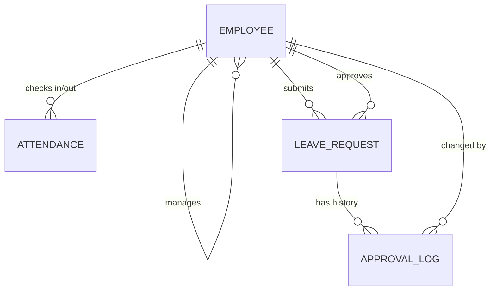

# Entity Model — HR Tool

## Metadata
- **Liên quan tới BR:** BR-001
- **Status:** approved
- **Owner:** Tuấn

## Entity Relationship Diagram

## Employee

| Attribute              | Description                                      |
|-------------------------|--------------------------------------------------|
| id                      | Unique identifier                                 |
| full_name               | Họ tên nhân viên                                  |
| email                   | Email công ty, dùng để login (UC-001)             |
| department              | Phòng ban                                          |
| manager_id              | FK → Employee.id, quản lý trực tiếp (self-ref)    |
| annual_leave_balance    | Số ngày phép còn lại, mặc định 12 ngày/năm        |
| start_date              | Ngày vào công ty                                  |

Có nhiều: `Attendance`, `LeaveRequest`.

## Attendance

| Attribute      | Description                                       |
|-----------------|-----------------------------------------------------|
| id              | Unique identifier                                   |
| employee_id     | FK → Employee.id                                    |
| date            | Ngày chấm công                                      |
| check_in_at     | Thời điểm check-in                                  |
| check_out_at    | Thời điểm check-out                                 |
| source          | `"web"` \| `"manual_by_hr"`                         |

Một `Employee` có nhiều `Attendance` — đúng 1 record/ngày (unique trên `employee_id` + `date`).

## LeaveRequest

| Attribute      | Description                                       |
|-----------------|-----------------------------------------------------|
| id              | Unique identifier                                   |
| employee_id     | FK → Employee.id, người xin nghỉ                    |
| type            | `"annual"` \| `"sick"` \| `"unpaid"`                |
| from_date       | Ngày bắt đầu nghỉ                                   |
| to_date         | Ngày kết thúc nghỉ                                  |
| reason          | Lý do xin nghỉ                                      |
| status          | `"pending"` \| `"approved"` \| `"rejected"` \| `"cancelled"` |
| approver_id     | FK → Employee.id, người duyệt                       |
| approved_at     | Thời điểm duyệt/từ chối                             |
| reject_reason   | Lý do từ chối (khi status = `"rejected"`)           |

**Business rule:** Số ngày nghỉ được tính theo **business day** — trừ weekend,
**không trừ ngày lễ quốc gia (holiday) ở MVP**. Lý do: chị Hà xác nhận tháng
đầu chỉ cần bỏ weekend là đủ, xử lý holiday sẽ để lại giai đoạn sau (xem
[BR-001 — Out of Scope](../business-requirements/BR-001-hr-tool.md#out-of-scope)).

## ApprovalLog

Lưu lại **mọi thay đổi status** của một `LeaveRequest`, phục vụ traceability
cho HR (ai đổi trạng thái gì, khi nào).

| Attribute        | Description                                     |
|-------------------|--------------------------------------------------|
| id                | Unique identifier                                |
| leave_request_id  | FK → LeaveRequest.id                             |
| from_status       | Trạng thái trước khi đổi                         |
| to_status         | Trạng thái sau khi đổi                           |
| changed_by        | FK → Employee.id, người thực hiện thay đổi       |
| changed_at        | Thời điểm thay đổi                               |

## MonthlyReport (view, không phải table)

**Không lưu trữ** — tính toán/tổng hợp trực tiếp từ `Attendance` +
`LeaveRequest` khi HR export CSV (UC-006). Các cột tổng hợp theo `employee`:

- `work_days` — số ngày có Attendance hợp lệ trong tháng
- `leave_days` — số business day đã nghỉ (theo rule ở `LeaveRequest`)
- `late_minutes` — tổng số phút check-in trễ trong tháng

## History
- v1 (2026-08-06, Tuấn): chốt bản cuối sau khi Tuấn phát hiện thiếu xử lý
  ngày lễ quốc gia; quyết định KHÔNG trừ holiday ở MVP, ghi rõ vào entity
  model và BR-001 Out of Scope.
